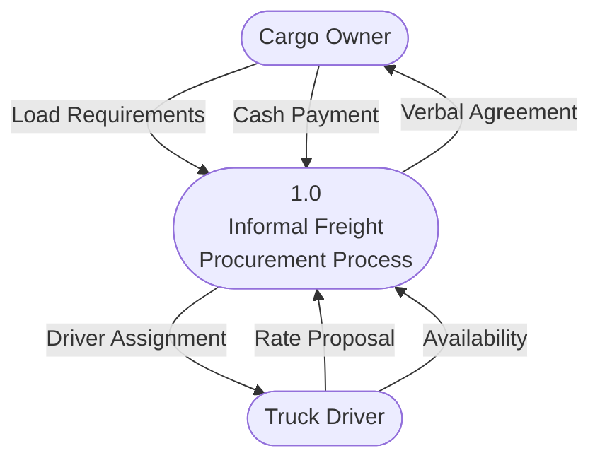

# HARARE INSTITUTE OF TECHNOLOGY
## FACULTY OF INFORMATION AND COMMUNICATION TECHNOLOGY
### DEPARTMENT OF SOFTWARE ENGINEERING

---

# TAKURABID: A DIGITAL FREIGHT MARKETPLACE PLATFORM FOR ZIMBABWE'S DOMESTIC LOGISTICS SECTOR

**Project Report Submitted in Partial Fulfilment of the Requirements for the Award of the Bachelor of Science Honours Degree in Software Engineering**

**HIT 400 / HIT 200 — Software Engineering Project**

---

| | |
|:---|:---|
| **Project Title** | TakuraBid: A Digital Freight Marketplace Platform |
| **Degree Programme** | BSc Honours in Software Engineering |
| **Department** | Software Engineering |
| **Institution** | Harare Institute of Technology |
| **Academic Year** | 2024 / 2025 |

---

**Project Team**

| Full Name | Role | Student Number |
|:----------|:-----|:---------------|
| Edith N. Muyambiri | Frontend and Backend Development | — |
| Princess B. Kwaniya | Database Architecture and AI Models | — |
| Matipa Brave Machangu | Documentation and Testing | — |
| Nyasha Nyekete | Documentation and Testing | — |

---

**Supervisor:** ___________________________

**Date of Submission:** ___________________________

---

## TABLE OF CONTENTS

- [Abstract](#abstract)
- [Preface](#preface)
- [Acknowledgements](#acknowledgements)
- [Dedication](#dedication)
- [Declaration](#declaration)
- [Chapter One — Introduction](#chapter-one--introduction)
- [Chapter Two — Literature Review](#chapter-two--literature-review)
- [Chapter Three — Analysis](#chapter-three--analysis)
- [Chapter Four — Design](#chapter-four--design)
- [Chapter Five — Implementation and Testing](#chapter-five--implementation-and-testing)
- [Chapter Six — Conclusions and Recommendations](#chapter-six--conclusions-and-recommendations)
- [References](#references)
- [Appendices](#appendices)

---

## LIST OF FIGURES

- Figure 3.1 — System Context Diagram (Existing System)
- Figure 3.2 — Data Flow Diagram — Level 0 (Existing System)
- Figure 3.3 — Data Flow Diagram — Level 1 (Existing System)
- Figure 3.4 — Use Case Diagram — Client Role
- Figure 3.5 — Use Case Diagram — Driver Role
- Figure 3.6 — Use Case Diagram — System Administrator
- Figure 4.1 — System Context Diagram (Proposed System)
- Figure 4.2 — Data Flow Diagram — Level 0 (Proposed System)
- Figure 4.3 — Data Flow Diagram — Level 1 (Proposed System)
- Figure 4.4 — Activity Diagram — Load Posting and Bidding Lifecycle
- Figure 4.5 — Activity Diagram — Job Confirmation and Execution
- Figure 4.6 — Activity Diagram — Messaging Workflow
- Figure 4.7 — Architectural Diagram — Monolithic Full-Stack Deployment
- Figure 4.8 — Entity-Relationship Diagram
- Figure 4.9 — Class Diagram — Core Domain Model
- Figure 4.10 — Sequence Diagram — Bid Submission and Acceptance
- Figure 4.11 — Sequence Diagram — Authentication Flow
- Figure 4.12 — Package Diagram — Application Module Structure

---

## LIST OF TABLES

- Table 1.1 — Proposed Tools and Justification
- Table 1.2 — Technical Feasibility Assessment
- Table 1.3 — Economic Feasibility Assessment
- Table 1.4 — Operational Feasibility Assessment
- Table 1.5 — Project Gantt Chart
- Table 2.1 — Comparative Analysis of Existing Freight Platforms
- Table 3.1 — Functional Requirements Specification
- Table 3.2 — Non-Functional Requirements Specification
- Table 4.1 — Database Schema — users Table
- Table 4.2 — Database Schema — loads Table
- Table 4.3 — Database Schema — bids Table
- Table 4.4 — Database Schema — jobs Table
- Table 4.5 — Database Schema — messages Table
- Table 4.6 — Database Schema — direct_messages Table
- Table 4.7 — Database Schema — notifications Table
- Table 4.8 — Database Schema — reviews Table
- Table 4.9 — API Route Reference
- Table 5.1 — Unit Test Cases — Authentication Module
- Table 5.2 — Unit Test Cases — Bid Submission Module
- Table 5.3 — Integration Test Cases
- Table 5.4 — System Test Cases
- Table 5.5 — Database Test Cases
- Table 5.6 — Acceptance Test Cases

---

## LIST OF ABBREVIATIONS

| Abbreviation | Expansion |
|:-------------|:----------|
| API | Application Programming Interface |
| CRUD | Create, Read, Update, Delete |
| CSS | Cascading Style Sheets |
| DB | Database |
| DFD | Data Flow Diagram |
| DOM | Document Object Model |
| ER | Entity-Relationship |
| FK | Foreign Key |
| HTTP | Hypertext Transfer Protocol |
| HTTPS | Hypertext Transfer Protocol Secure |
| JSON | JavaScript Object Notation |
| JWT | JSON Web Token |
| MVC | Model-View-Controller |
| OOP | Object-Oriented Programming |
| PK | Primary Key |
| REST | Representational State Transfer |
| RLS | Row-Level Security |
| SPA | Single-Page Application |
| SQL | Structured Query Language |
| SSR | Server-Side Rendering |
| TSX | TypeScript XML (React JSX with TypeScript) |
| UI | User Interface |
| UML | Unified Modelling Language |
| URL | Uniform Resource Locator |
| UUID | Universally Unique Identifier |

---

## ABSTRACT

TakuraBid is a full-stack digital freight marketplace engineered to address systemic inefficiencies in Zimbabwe's domestic logistics procurement sector. The platform operationalises a competitive, transparent bidding model wherein cargo owners — referred to as clients — post structured freight load postings, and licensed truck drivers submit itemised rate proposals against those loads in real time. Upon a client selecting and accepting a preferred bid, the system automatically provisions a formalised job contract, activates a bidirectional messaging channel between both parties, and surfaces a complete delivery progress tracking interface through a role-partitioned dashboard.

The platform was developed as a monolithic full-stack web application using the Next.js 16 App Router paradigm with React 19 as the UI runtime, TypeScript 5.9 for end-to-end static type safety, Tailwind CSS 3.4 for utility-first styling, and Supabase-hosted PostgreSQL as the persistent data store. All server-side business logic is implemented through Next.js Route Handlers co-located with the application, eliminating the need for a separate backend service.

The system implements custom cookie-based session management — intentionally avoiding Supabase Auth and JWT token exchange in favour of a deterministic, server-readable HTTP cookie mechanism — enforced at the network boundary by Next.js Edge Middleware on every inbound request.

TakuraBid addresses four primary deficiencies in the current informal freight procurement landscape: opaque and inconsistent pricing, the absence of a structured digital marketplace for domestic haulage, the lack of verified driver credential management, and the non-existence of analytics tooling for logistics expenditure optimisation. The platform enforces role-level access controls, structured bid auditing, bidirectional post-completion review submission, and a complete load lifecycle from initial posting through confirmed delivery.

---

## PREFACE

This document constitutes the formal project report for TakuraBid, submitted in partial fulfilment of the requirements for the Bachelor of Science Honours Degree in Software Engineering at the Harare Institute of Technology. The work described herein was conducted between the first and fourth academic semesters of the HIT 200 and HIT 400 project modules.

The project was conceived in direct response to observed inefficiencies in Zimbabwe's freight and logistics sector, where cargo owners and truck operators continue to rely on informal, telephone-based negotiation mechanisms that expose both parties to pricing opacity, contractual uncertainty, and logistical delays. TakuraBid represents a structured, technology-driven response to these inefficiencies.

The report is structured in accordance with the HIT 400/200 Software Engineering Project Documentation Guide issued by the Department of Software Engineering and covers all prescribed analytical, design, implementation, and testing phases of the software engineering lifecycle.

---

## ACKNOWLEDGEMENTS

The project team wishes to express sincere gratitude to the Department of Software Engineering at Harare Institute of Technology for providing the academic framework, infrastructure, and supervision support that made this project possible. The guidance offered by project supervisors throughout the analysis, design, and implementation phases was instrumental in maintaining engineering discipline and academic rigour.

The team further acknowledges the logistics sector stakeholders — freight operators, truck drivers, and cargo owners — who participated in information-gathering interviews and questionnaire completion during the system analysis phase. Their domain expertise provided the empirical grounding upon which the system requirements were formulated.

---

## DEDICATION

This work is dedicated to the students and faculty of the Harare Institute of Technology, and to the operators, drivers, and logistics professionals of Zimbabwe's freight sector whose daily challenges provided the motivation for this project.

---

## DECLARATION

We, the undersigned, declare that the work contained in this report is our original work submitted in partial fulfilment of the requirements for the Bachelor of Science Honours Degree in Software Engineering at the Harare Institute of Technology. This work has not been submitted for any other academic qualification at any institution. All sources of information have been duly acknowledged in the references section.

| Name | Signature | Date |
|:-----|:----------|:-----|
| Edith N. Muyambiri | __________________ | __________ |
| Princess B. Kwaniya | __________________ | __________ |
| Matipa Brave Machangu | __________________ | __________ |
| Nyasha Nyekete | __________________ | __________ |

---

---

# CHAPTER ONE — INTRODUCTION

## 1.1 Background to the Study

Zimbabwe's domestic freight and logistics sector constitutes a critical component of the national economy, facilitating the movement of agricultural produce, manufactured goods, construction materials, and consumables across the country's road network. Despite its economic significance, the sector has remained largely undigitised, with freight procurement and driver engagement continuing to rely on informal telephone and word-of-mouth networks.

The prevailing procurement model requires cargo owners to maintain personal contact directories of truck operators and negotiate rates bilaterally — a process characterised by information asymmetry, pricing opacity, and an absence of contractual formalisation. Freight rates are agreed verbally without structured records, and there is no mechanism by which a cargo owner can access competitive pricing from multiple drivers simultaneously. This structural inefficiency results in supra-competitive pricing for cargo owners and inconsistent income streams for independent truck operators who lack visibility beyond their personal networks.

Digital freight marketplaces have emerged internationally as an effective technological intervention for analogous inefficiencies. Platforms such as Uber Freight (United States), Convoy (United States), and Kobo360 (West Africa) have demonstrated that competitive, transparent bidding mechanisms can substantially reduce freight procurement costs, improve asset utilisation for fleet operators, and introduce contract formalisation into previously informal markets. No equivalent platform exists within Zimbabwe's domestic logistics market.

TakuraBid was conceived as a domain-specific digital marketplace to address these structural gaps. The platform enables cargo owners to post freight load specifications, receive competitive bids from licensed truck drivers, accept a preferred proposal, formalise the engagement as a provisional job contract, and track the delivery lifecycle through a unified web interface. The system is designed to be accessible from any standards-compliant web browser without requiring a native mobile application installation, lowering the adoption barrier for operators with limited technical exposure.

## 1.2 Statement of the Problem

Zimbabwe's domestic freight procurement is characterised by persistent systemic inefficiencies that impose measurable economic costs on both cargo owners and truck operators:

1. **Pricing opacity and inconsistency**: Freight rates are determined through bilateral verbal negotiation with no reference to standardised market rates. Cargo owners routinely pay significantly divergent prices for equivalent routes and cargo types, with no mechanism for verification or comparison.

2. **Absence of a structured digital marketplace**: There is no centralised platform in Zimbabwe through which a cargo owner can post a freight requirement and receive competing proposals from multiple licensed operators. The market operates as a fragmented, relationship-based informal network.

3. **Unverified driver credentials and capacity**: Cargo owners have no systematic means of assessing driver licensing status, fleet capacity, or operational history prior to engagement. This exposes shipments to elevated risk and limits the ability to make informed hiring decisions.

4. **No structured communication or contract record**: Freight engagements produce no durable written record. Disputes over agreed rates, delivery timelines, or cargo condition have no documentary basis for resolution.

5. **No analytics tooling for logistics expenditure**: Cargo owners operating at commercial scale have no mechanism for tracking freight expenditure trends, route cost benchmarking, or carrier performance evaluation over time.

TakuraBid is designed to resolve each of these deficiencies within a single, integrated web platform.

## 1.3 Research Objectives

The following objectives govern the design, development, and evaluation of TakuraBid. Each objective is expressed as a specific, measurable deliverable:

**1.3.1 Primary Objectives**

- **TO** design and implement a competitive freight bidding system that allows registered cargo owners to post structured load specifications and receive simultaneous rate proposals from multiple registered truck drivers, thereby enabling market-rate price discovery.

- **TO** develop a role-partitioned user management system that enforces access control at both the network boundary (Edge Middleware) and application layer (Route Handler role validation), ensuring that clients and drivers interact exclusively with the functionality appropriate to their role.

- **TO** implement a structured load lifecycle management system with formally defined state transitions — from `In Bidding` through `Assigned`, `In Transit`, to `Completed` — with each transition triggered by authenticated, role-validated API operations.

- **TO** provision an automated job contract system that creates a formal job record upon bid acceptance, requiring explicit two-step confirmation (client acceptance of bid, followed by driver acceptance of job) before the contract is activated.

- **TO** develop a bidirectional, job-scoped messaging system and an independent direct-message channel, providing structured communication between parties at both the contract level and the platform level.

- **TO** implement analytics dashboards for both client and driver roles, aggregating key performance metrics including freight expenditure, delivery success rates, earnings trends, and bid acceptance rates.

**1.3.2 Secondary Objectives**

- **TO** produce a database schema that enforces relational integrity across all eight entity tables through explicit foreign key constraints, with application-layer access control in lieu of database-level Row-Level Security policies.

- **TO** implement a custom cookie-based authentication mechanism, independent of third-party authentication services, providing deterministic session management across server-side Edge Middleware and Route Handler contexts.

- **TO** design the system architecture as a deployable, monolithic full-stack Next.js application, eliminating cross-origin complexity and enabling server-side data access within the same process as the UI rendering layer.

## 1.4 Research Hypothesis

It is hypothesised that the introduction of a structured digital freight marketplace, operationalising competitive bidding, formal contract provisioning, and role-specific analytics, will measurably reduce the time required to finalise freight engagements and the pricing variance experienced by cargo owners relative to the current informal negotiation model. Specifically:

- The average time from load posting to bid acceptance will not exceed 24 hours under normal market conditions with an adequate pool of registered drivers.
- The platform's transparent bidding mechanism will produce freight rates within a computable range of market-competitive pricing, eliminating the information asymmetry that currently enables supra-competitive pricing.

## 1.5 Justification of the Study

The justification for TakuraBid is grounded in three dimensions:

**1.5.1 Economic Justification**

Zimbabwe's logistics sector accounts for a significant proportion of the cost structure of domestic trade. Reducing freight procurement costs through competitive bidding directly reduces the operational costs of businesses reliant on road freight, contributing to improved commercial competitiveness. For truck operators, increased market visibility beyond personal networks translates to higher asset utilisation rates and more stable income streams.

**1.5.2 Technological Justification**

The successful deployment of digital freight marketplaces in comparable developing-economy contexts — including Kobo360 in Nigeria and Lori Systems across East Africa — demonstrates the technical viability and commercial sustainability of the platform model in markets with infrastructure characteristics similar to Zimbabwe. The application of mature, production-grade web technologies (Next.js, PostgreSQL, TypeScript) ensures the platform is built on a stable, well-documented technical foundation.

**1.5.3 Academic Justification**

This project provides a comprehensive exercise in full-stack software engineering, encompassing domain analysis, relational database design, REST API architecture, client-server authentication, React component engineering, and structured software testing — directly engaging with the core competencies of the Bachelor of Science in Software Engineering programme.

## 1.6 Proposed Tools and Technologies

**Table 1.1 — Proposed Tools and Justification**

| Layer | Technology | Version | Justification |
|:------|:-----------|:--------|:--------------|
| Application Framework | Next.js (App Router) | 16.1.4 | Provides integrated server and client rendering, Route Handlers for API logic, Edge Middleware for auth enforcement, and a mature production build pipeline. Eliminates the need for a separate backend service. |
| UI Runtime | React | 19.2.3 | Industry-standard declarative UI library with Context API for global state management. React 19 introduces concurrent rendering optimisations and improved server component integration. |
| Language | TypeScript | 5.9.3 | Provides end-to-end static type safety across both server-side Route Handlers and client-side React components, eliminating an entire class of runtime errors through compile-time type checking. |
| Styling | Tailwind CSS | 3.4.19 | Utility-first CSS framework enabling rapid UI construction without authoring component-scoped CSS files. Custom component utility classes are consolidated in `globals.css`. |
| Database | Supabase PostgreSQL | Latest | Managed PostgreSQL hosting with integrated PostgREST REST API layer, real-time subscriptions, and Supabase JS SDK for typed query construction. Eliminates database infrastructure management overhead. |
| Database Client | Supabase JS SDK | 2.97.0 | Provides a typed, fluent query builder over the PostgREST REST API, with support for complex filtering, joins, and real-time subscriptions. |
| Build Tooling | Next.js SWC Compiler | — | Rust-based transpilation replacing Babel/Webpack. Provides order-of-magnitude improvement in compilation speed and smaller production bundles. |
| Linting | ESLint + TypeScript ESLint | 9.x | Static code analysis with TypeScript-aware lint rules, enforcing code quality standards and preventing common type-related antipatterns. |
| CSS Post-processing | PostCSS + Autoprefixer | 8.x / 10.x | Ensures cross-browser CSS compatibility by automatically applying vendor-specific property prefixes. |
| Version Control | Git / GitHub | — | Distributed version control for collaborative development and change auditing across the project team. |

## 1.7 Feasibility Study

### 1.7.1 Technical Feasibility

**Table 1.2 — Technical Feasibility Assessment**

| Criterion | Assessment | Finding |
|:----------|:-----------|:--------|
| Development team competency | The project team has prior exposure to JavaScript, TypeScript, and relational database design through coursework. | Feasible with targeted upskilling. |
| Technology stack maturity | Next.js 16, React 19, and Supabase PostgreSQL are production-grade technologies with extensive documentation and community support. | Fully feasible. |
| Infrastructure requirements | Supabase provides hosted PostgreSQL with a free tier adequate for development and academic demonstration. Next.js can be deployed to Vercel or any Node.js host. | Fully feasible with no infrastructure cost. |
| Development tools availability | Node.js 18+, a modern web browser, VS Code, and Git are freely available and cross-platform. | Fully feasible. |
| Integration complexity | The monolithic Next.js architecture co-locates server and client code, eliminating cross-origin API complexity. The Supabase JS SDK provides a typed client abstraction over raw SQL. | Low complexity. Feasible. |

**Technical Feasibility Conclusion**: The proposed technology stack is technically viable within the constraints of the academic project. No specialised infrastructure beyond freely available cloud services is required. The team's existing competencies, supplemented by the comprehensive documentation available for all selected technologies, are sufficient to deliver the system.

### 1.7.2 Economic Feasibility

**Table 1.3 — Economic Feasibility Assessment**

| Cost Category | Estimated Cost | Notes |
|:--------------|:---------------|:------|
| Software licences | USD 0.00 | All development tools are open-source or free-tier. |
| Database hosting (Supabase) | USD 0.00 | Supabase free tier provides 500 MB database, adequate for development. |
| Application hosting (Vercel) | USD 0.00 | Vercel free tier supports Next.js deployments with full App Router support. |
| Domain name | USD 10–15 / year | Optional for production deployment. |
| Development labour | Academic (non-commercial) | Project labour is provided by the student team under academic programme terms. |
| **Total Estimated Cost** | **USD 0–15** | — |

**Economic Feasibility Conclusion**: The project is economically feasible within the zero-cost academic development context. The commercially deployed platform would require paid infrastructure tiers for production-scale database storage, CDN bandwidth, and domain registration, but these costs are proportional to usage and deferred to post-academic deployment.

### 1.7.3 Operational Feasibility

**Table 1.4 — Operational Feasibility Assessment**

| Criterion | Assessment |
|:----------|:-----------|
| User technical literacy | The platform is delivered as a standard web application accessible via any modern browser. No software installation is required. Basic literacy in web navigation is sufficient for all user operations. |
| System maintainability | The monolithic Next.js architecture, TypeScript static typing, and structured directory layout facilitate maintainability. ESLint and type checking enforce code quality standards. |
| Data integrity | PostgreSQL foreign key constraints enforce relational integrity. Application-layer role validation and constraint checks prevent invalid state transitions. |
| Scalability | Supabase PostgreSQL supports horizontal read scaling through connection pooling. Next.js supports incremental static regeneration and edge caching. The architecture is horizontally scalable at the application tier through deployment on platforms supporting autoscaling (e.g., Vercel, Railway). |
| Regulatory considerations | The platform handles personally identifiable information (user names, contact details) and must be operated in compliance with applicable data protection legislation. No payment processing is implemented in the current version; financial settlement is handled externally between parties. |

**Operational Feasibility Conclusion**: The system is operationally feasible. Its web-based delivery model minimises adoption friction. The underlying technology stack is well understood and supported by active developer communities.

## 1.8 Project Plan

### 1.8.1 Work Breakdown Structure

The project was organised into the following sequential phases:

1. **Requirements Elicitation** — Stakeholder interviews, questionnaire design and distribution, information gathering, requirements documentation.
2. **System Analysis** — Existing system analysis, UML context diagrams, DFD construction, alternative system evaluation, use case specification.
3. **System Design** — Architectural design, database ER diagram and normalisation, class diagrams, sequence diagrams, interface wireframing.
4. **Database Implementation** — PostgreSQL schema creation, table provisioning, constraint enforcement, sample data seeding.
5. **Backend Implementation** — Route Handler development, authentication middleware, Supabase query integration.
6. **Frontend Implementation** — React component development, Tailwind CSS styling, Context API state management, page routing.
7. **Integration** — End-to-end integration of frontend, backend Route Handlers, and Supabase database.
8. **Testing** — Unit, module, integration, system, database, and acceptance testing.
9. **Documentation** — Technical documentation, user manual, report compilation.

### 1.8.2 Gantt Chart

**Table 1.5 — Project Gantt Chart**


---

# CHAPTER TWO — LITERATURE REVIEW

## 2.1 Introduction

This chapter presents a critical review of the theoretical foundations, prior academic research, and existing commercial implementations relevant to the design and development of TakuraBid. The review is structured across three thematic areas: digital marketplace theory, freight and logistics platform architecture, and authentication and security models for web-based transaction systems. The review identifies the research gap that TakuraBid addresses and provides justification for the design decisions made during the system's development.

## 2.2 Digital Freight Marketplaces

### 2.2.1 The Economics of Digital Marketplace Platforms

Digital marketplaces — defined as two-sided platforms that facilitate transactions between distinct buyer and seller populations — have been extensively studied in the platform economics literature. Rochet and Tirole (2003) [1] established the foundational theoretical model for two-sided markets, demonstrating that platforms create value by reducing transaction costs between buyer and seller populations who would otherwise struggle to locate, evaluate, and transact with one another. The freight marketplace model is a direct application of this principle: cargo owners (buyers of transport capacity) and truck operators (sellers of transport capacity) represent the two sides of the platform.

Parker and Van Alstyne (2005) [2] extended this framework by demonstrating that network effects — specifically, the tendency for platform value to increase as the number of participants on both sides grows — are the primary driver of platform competitive advantage. For TakuraBid, this implies that the platform's utility to individual cargo owners increases as the pool of registered drivers grows, and vice versa, creating a self-reinforcing growth dynamic once critical mass is achieved.

### 2.2.2 International Digital Freight Platforms

Several international platforms have demonstrated the commercial viability and operational effectiveness of the digital freight marketplace model:

**Uber Freight** (United States, 2017): Uber Freight operationalises dynamic pricing and instant load-driver matching using algorithmic rate calculation. The platform processes tens of thousands of loads daily across the continental United States. Its primary innovation was the elimination of freight broker intermediaries through direct, app-mediated driver engagement [3].

**Convoy** (United States, 2015): Convoy employs machine learning models to predict optimal load groupings and backhaul opportunities, improving asset utilisation rates for fleet operators. Convoy's published research demonstrates a 45% reduction in empty miles driven by participating carriers [4].

**Kobo360** (Nigeria, 2017): Kobo360 represents the most geographically relevant precedent for TakuraBid. Operating across West and East Africa, Kobo360 addresses freight matching in markets characterised by informal operator networks, poor road infrastructure, and limited digital literacy — conditions directly analogous to Zimbabwe's logistics environment. The platform has processed over USD 900 million in freight transactions and demonstrated the applicability of the competitive bidding model in sub-Saharan African markets [5].

**Lori Systems** (Kenya, 2016): Lori Systems focuses on cross-border freight across East Africa, demonstrating that digital freight marketplaces can extend beyond single-country domestic markets to address regional logistics corridors [6].

### 2.2.3 The Research Gap

None of the platforms identified above operate within Zimbabwe's domestic freight market. The closest comparable platform — Kobo360 — operates in Nigeria and selected East African markets but has no Zimbabwean market presence. Zimbabwe's freight sector therefore represents an unaddressed market opportunity for a domestically developed and operated digital freight marketplace. TakuraBid is designed to fill this gap.

**Table 2.1 — Comparative Analysis of Existing Freight Platforms**

| Platform | Market | Bidding Model | Driver Verification | Analytics | Messaging | Relevance to TakuraBid |
|:---------|:-------|:--------------|:--------------------|:----------|:----------|:-----------------------|
| Uber Freight | USA | Instant matching | Licenced carriers only | Earnings reporting | In-app | Confirms commercial viability; closed model unsuitable for Zimbabwe |
| Convoy | USA | Automated | Vetted carriers | Advanced ML analytics | In-app | Technically sophisticated; overkill for current scope |
| Kobo360 | West/East Africa | Competitive bidding | Profile-based | Basic | Limited | Most directly analogous; confirms model viability in African markets |
| Lori Systems | East Africa | Negotiated rates | Registration-based | Route analytics | Platform | Relevant for future cross-border extension |
| TakuraBid | Zimbabwe | Competitive bidding | Profile-based | Role-specific dashboards | Job-scoped + DM | Proposed system |

## 2.3 Web Application Architecture for Marketplace Systems

### 2.3.1 Monolithic versus Microservices Architectures

Contemporary web application architecture literature presents two dominant structural paradigms: monolithic architectures, in which all application logic is contained within a single deployable unit, and microservices architectures, in which discrete business domains are implemented as independently deployable services communicating over a network.

Newman (2015) [7] establishes the theoretical advantages of microservices — independent scalability, fault isolation, and technology heterogeneity — but also acknowledges the significant operational complexity they introduce, including distributed tracing, service discovery, and inter-service authentication. For teams of limited size operating without dedicated DevOps infrastructure, this complexity frequently offsets the architectural benefits.

Fowler and Lewis (2014) [8] articulate the "microservice premium" concept, arguing that organisations should exhaust the scalability limits of a monolithic architecture before incurring the operational overhead of decomposition. For an academic project of defined scope and team size, the monolithic architecture is the evidently appropriate choice.

TakuraBid is implemented as a monolithic full-stack Next.js application in direct application of this principle. The Next.js App Router paradigm provides a structured approach to co-locating server-side Route Handlers with client-side page components, achieving a clean separation of concerns without the operational complexity of microservices.

### 2.3.2 Server-Side Rendering and the Next.js App Router

The Next.js App Router, introduced in Next.js 13 and matured through version 16, implements a hybrid rendering model combining React Server Components (RSC) with traditional Client Components. Vercel's engineering documentation [9] describes this model as enabling per-component rendering strategy selection: server components execute on the server and stream HTML to the browser, while client components are hydrated in the browser for interactivity.

For TakuraBid, this architecture is leveraged to ensure that role-protected page components are validated server-side before UI rendering occurs, preventing unauthorised UI exposure even in the absence of a client-side access check.

### 2.3.3 REST API Design for Freight Marketplace Systems

The system's Route Handlers implement REST (Representational State Transfer) architectural constraints as defined by Fielding (2000) [10]. Each resource — loads, bids, jobs, messages, users — is addressed by a distinct URL namespace, and operations are expressed through standard HTTP methods (GET, POST, PUT). The system follows convention-over-configuration REST design principles: collection endpoints (`/api/loads`) address the resource class, and individual resource endpoints (`/api/loads/[loadId]`) address specific instances.

## 2.4 Authentication and Session Management

### 2.4.1 Cookie-Based Session Authentication

Session authentication using HTTP cookies is one of the oldest and most well-understood authentication mechanisms in web application development. Rescorla (2018) [11] describes the security properties of the `SameSite` cookie attribute, which mitigates Cross-Site Request Forgery (CSRF) attacks by restricting cookie transmission to same-origin requests. TakuraBid uses `SameSite=Lax` cookies to balance CSRF protection with standard navigation compatibility.

### 2.4.2 JWT-Based Authentication

JSON Web Tokens (JWT) are a stateless alternative to session cookies, encoding claims directly into a cryptographically signed token that is transmitted with each request. The primary advantage of JWTs — statelessness — is also their primary security liability: a compromised token cannot be invalidated before its expiry without introducing a server-side revocation list, which partially negates the statelessness benefit [12].

For TakuraBid, the decision was made to implement custom cookie-based session management rather than JWTs. This decision was informed by the observation that the application's server-side Route Handlers require database access on every authenticated request regardless of authentication mechanism, making the statelessness of JWTs non-advantageous in this context.

### 2.4.3 Supabase Auth vs. Custom Authentication

Supabase Auth provides a managed authentication service including email/password, OAuth, and magic link flows. However, its integration with Next.js 16 Route Handlers — particularly its reliance on the `@supabase/auth-helpers-nextjs` package and the `cookies()` API from `next/headers` — introduces reliability issues in the App Router Route Handler context, where `cookies()` from `next/headers` does not reliably read request-scoped cookies.

The decision to implement custom authentication by reading `req.cookies` directly from the `NextRequest` object passed to each Route Handler was informed by this observed behaviour and the corresponding Next.js 16 documentation [13]. This approach uses the same cookie-reading mechanism as the Edge Middleware, ensuring consistency across all server-side request processing contexts.

## 2.5 Database Design for Transaction Platforms

### 2.5.1 Relational Database Modelling for Marketplace Entities

Date (2003) [14] establishes that well-normalised relational schemas are essential for maintaining data integrity in transaction-processing systems. The TakuraBid schema applies third normal form (3NF) normalisation across all tables, ensuring that non-key attributes depend exclusively on the primary key of their respective tables.

### 2.5.2 UUID vs. Sequential Integer Primary Keys

The choice between UUID and sequential integer primary keys carries implications for both security and scalability. Sequential integer keys are predictable — knowledge of one valid identifier enables enumeration of adjacent identifiers. UUID v4 keys, generated pseudorandomly, are non-enumerable, preventing trivial resource enumeration attacks [15].

TakuraBid uses UUID primary keys for user-created entities (bids, messages, direct messages, notifications, reviews) and application-generated TEXT keys for loads (`LOAD{timestamp}`) and jobs (`JOB{timestamp}`). The TEXT key strategy for loads and jobs was adopted to produce human-readable identifiers that facilitate manual record identification and customer support operations.

## 2.6 Conclusion

The literature review establishes that digital freight marketplaces represent a proven, economically viable platform model with directly relevant precedents in developing economy contexts. The monolithic Next.js architecture is the appropriate structural choice for a project of this scope. Custom cookie-based authentication with direct `req.cookies` access provides the most reliable session management mechanism within the Next.js 16 Route Handler context. A well-normalised PostgreSQL relational schema with UUID primary keys is the appropriate data persistence layer for a transaction-processing marketplace. TakuraBid's design applies each of these evidence-based principles.

---

# CHAPTER THREE — ANALYSIS

## 3.1 Information Gathering

The system analysis phase employed three primary information-gathering instruments to elicit requirements from domain stakeholders and evaluate the existing informal freight procurement system.

### 3.1.1 Structured Interviews

Semi-structured interviews were conducted with five cargo owners operating in the Harare metropolitan area and five independent truck operators. Interview questions were designed to elicit:

- Current freight procurement workflow (how loads are advertised, how drivers are engaged, how rates are negotiated)
- Primary pain points in the current process
- Technology familiarity and device access
- Willingness to adopt a digital platform for freight procurement
- Desired features in a digital freight marketplace

**Key Findings from Interviews:**

- All five cargo owners reported relying on telephone-based negotiation with a fixed set of personal contacts, with no exposure to competing rates.
- Four of five cargo owners reported having overpaid for freight on at least one occasion due to lack of market rate information.
- All five drivers reported inconsistent load availability, with extended periods of asset downtime between engagements.
- Three of five drivers expressed interest in a platform that would expose them to a broader pool of cargo owners.
- All respondents owned and used smartphones capable of accessing standard web applications.

### 3.1.2 Questionnaire Survey

A structured questionnaire was distributed to a broader sample of 20 logistics sector participants (10 cargo owners, 10 truck operators). The questionnaire used a five-point Likert scale to assess the perceived severity of identified problems and the desirability of proposed platform features.

**Selected Questionnaire Results:**

| Statement | Mean Score (1–5) | Interpretation |
|:----------|:-----------------|:---------------|
| "I find it difficult to get competitive freight prices" | 4.3 | Strong agreement |
| "I would use a platform to compare bids from multiple drivers" | 4.6 | Strong agreement |
| "I would trust a platform to manage my freight engagements" | 3.8 | Moderate agreement |
| "I find it difficult to find consistent work as a driver" | 4.4 | Strong agreement |
| "A messaging system within the platform would be useful" | 4.7 | Strong agreement |

### 3.1.3 Observation of Existing Workflow

Direct observation of freight negotiations at a commercial transport depot in Harare revealed the following existing system process:

1. Cargo owner arrives at depot or telephones dispatcher.
2. Dispatcher contacts known drivers by telephone to check availability.
3. Rate negotiation occurs verbally between dispatcher and driver.
4. Agreement is reached verbally; no written record is generated.
5. Cargo owner pays upon delivery, with no structured receipt or audit trail.

This observation confirmed the complete absence of digitisation, competitive pricing, or contractual formalisation in the existing system.

## 3.2 Description of the Existing System

The existing freight procurement system in Zimbabwe's domestic market is characterised by the following structural properties:

**Actors**: Cargo owner, Truck driver, Informal dispatcher/broker (optional intermediary).

**Processes**:
- Load advertisement through word of mouth or direct telephone contact.
- Rate negotiation conducted bilaterally without reference to market benchmarks.
- Verbal agreement on rate, pickup date, and delivery timeline.
- Physical or telephonic handover of cargo details.
- Delivery execution without formal tracking.
- Cash settlement upon delivery.

**Data Stores**: No structured data stores exist. Individual parties may maintain informal personal records in notebooks or mobile phone contacts.

**Limitations**:
- No concurrency: a cargo owner can only negotiate with one driver at a time.
- No audit trail: no record of agreed terms, cargo specifications, or delivery confirmation.
- No verification: no mechanism for assessing driver credentials, vehicle capacity, or operational history.
- No analytics: no aggregate data on freight expenditure, route costs, or carrier performance.

## 3.3 Data Flow Diagrams — Existing System

### Figure 3.1 — System Context Diagram (Existing System)


The existing system context diagram depicts a single-process system (informal freight procurement) with two external entities (cargo owner and truck driver) communicating through the system via entirely informal channels. No digital data stores are involved.

### Figure 3.2 — Data Flow Diagram — Level 0 (Existing System)



### Figure 3.3 — Data Flow Diagram — Level 1 (Existing System)


## 3.4 Evaluation of Alternative Systems

Prior to finalising the design of TakuraBid, three alternative system approaches were evaluated:

**Alternative 1: WhatsApp-Based Group Coordination**
Cargo owners and drivers could be organised into WhatsApp groups through which loads are advertised and bids solicited informally. This approach has zero development cost but provides no structured data capture, no access control, no analytics, no contractual formalisation, and no scalability beyond group size limits. Rejected on grounds of inadequate structural control.

**Alternative 2: Adaptation of an Existing Open-Source Classified Advertisement Platform**
Open-source classified advertisement systems (e.g., Yclas, OpenClassifieds) could be adapted for freight load posting. These platforms provide basic listing functionality but lack bidding mechanics, role-partitioned access, job contract provisioning, or analytics. Significant adaptation effort would be required to implement freight-specific features, and the underlying architecture may not support the required data model. Rejected on grounds of inadequate fit with domain requirements.

**Alternative 3: Custom-Built Digital Freight Marketplace (TakuraBid)**
A purpose-built full-stack web application, designed specifically for the freight marketplace domain, implementing competitive bidding, structured load lifecycle management, job contract provisioning, bidirectional messaging, and role-specific analytics. Higher initial development effort, but provides complete control over data model, business logic, and user experience. Selected as the proposed system.

## 3.5 Functional Analysis of the Proposed System

### 3.5.1 Functional Requirements

**Table 3.1 — Functional Requirements Specification**

| ID | Requirement | Actor | Priority |
|:---|:------------|:------|:---------|
| FR-01 | The system shall allow users to register with either a CLIENT or DRIVER role, providing name, email, password, and role-specific profile information. | Any | High |
| FR-02 | The system shall authenticate users via email and password, persisting the session as an HTTP cookie named `takura_user` containing the authenticated user's UUID. | Any | High |
| FR-03 | The system shall allow authenticated CLIENT users to create freight load postings specifying cargo type, weight, origin city, destination city, distance, budget, pickup date, delivery date, urgency classification, and optional special requirements. | CLIENT | High |
| FR-04 | The system shall display all loads with status `In Bidding` on a public load board accessible to authenticated DRIVER users. | DRIVER | High |
| FR-05 | The system shall allow authenticated DRIVER users to submit a bid on any load with status `In Bidding`, specifying a USD amount and an optional cover message. The system shall enforce a maximum of one bid per driver per load. | DRIVER | High |
| FR-06 | The system shall allow the CLIENT who posted a load to view all bids submitted against that load, including the bidding driver's profile information and proposed rate. | CLIENT | High |
| FR-07 | The system shall allow a CLIENT to accept one bid from among all bids submitted against their load. Upon acceptance, the system shall: (a) reject all other bids for that load, (b) update the load status to `Assigned`, (c) provision a new job record with status `Pending`. | CLIENT | High |
| FR-08 | The system shall allow the DRIVER assigned to a job to accept the job offer, transitioning the job status from `Pending` to `Active`. | DRIVER | High |
| FR-09 | The system shall allow authenticated users to exchange messages within the context of an active job (job-scoped messages). | CLIENT, DRIVER | High |
| FR-10 | The system shall allow any authenticated user to send and receive direct messages with any other registered user, independent of any job relationship. | Any | Medium |
| FR-11 | The system shall allow a CLIENT to send a direct job offer to a specific DRIVER, creating a `Pending` job record without requiring the bidding process. | CLIENT | Medium |
| FR-12 | The system shall provide a CLIENT analytics dashboard aggregating total freight expenditure, on-time delivery rate, route volume distribution, monthly cost trends, and average cost per kilometre. | CLIENT | Medium |
| FR-13 | The system shall provide a DRIVER analytics dashboard aggregating total earnings, kilometres driven, bid acceptance rate, weekly earnings distribution, profile views, and profile clicks. | DRIVER | Medium |
| FR-14 | The system shall allow users to view and update their profile information, including contact details, vehicle information (DRIVER), and company information (CLIENT). | Any | Medium |
| FR-15 | The system shall generate a notification for the recipient user upon receipt of a direct message, bid acceptance, or job offer. | Any | Low |
| FR-16 | The system shall allow both CLIENT and DRIVER users to submit a star rating and written review upon job completion. | CLIENT, DRIVER | Low |

### 3.5.2 Non-Functional Requirements

**Table 3.2 — Non-Functional Requirements Specification**

| ID | Requirement | Category | Metric |
|:---|:------------|:---------|:-------|
| NFR-01 | The system shall enforce access control such that CLIENT-role API endpoints return HTTP 403 for DRIVER-authenticated requests, and vice versa. | Security | 100% of role-mismatched requests rejected |
| NFR-02 | The system shall enforce the presence of a valid `takura_user` session cookie on all non-public route requests via Edge Middleware, returning HTTP 401 for unauthenticated API requests and HTTP 302 redirect to `/auth/login` for unauthenticated page requests. | Security | 100% of unauthenticated requests intercepted |
| NFR-03 | The system shall respond to all API requests within 2,000 milliseconds under normal load conditions (concurrent users < 100). | Performance | 95th percentile response time < 2,000 ms |
| NFR-04 | The system shall be accessible via any modern standards-compliant web browser (Chrome 120+, Firefox 120+, Safari 17+, Edge 120+) without requiring browser extensions or native application installation. | Compatibility | 100% of target browsers supported |
| NFR-05 | The system's database schema shall enforce foreign key constraints across all relational associations, preventing orphaned records. | Data Integrity | 0 orphaned records under any application operation |
| NFR-06 | The system shall enforce a single-bid-per-driver-per-load constraint, preventing duplicate bid submission through a database-level uniqueness check prior to insertion. | Data Integrity | 0 duplicate bids accepted |
| NFR-07 | All user passwords shall be stored as bcrypt-hashed values; plaintext passwords shall not be persisted at any layer of the system. | Security | 0 plaintext passwords in database |
| NFR-08 | The system's user interface shall be responsive, rendering correctly on screen widths from 375px (mobile) to 1920px (desktop). | Usability | Verified across all target breakpoints |
| NFR-09 | The system shall maintain session state across page navigations and browser refresh events through AuthProvider re-hydration of the session cookie from `localStorage`. | Reliability | 100% session continuity across navigations |

## 3.6 Use Case Diagrams

### Figure 3.4 — Use Case Diagram — CLIENT Role


### Figure 3.5 — Use Case Diagram — DRIVER Role


---

# CHAPTER FOUR — DESIGN

## 4.1 System Context Diagram (Proposed System)

### Figure 4.1 — System Context Diagram (Proposed System)


## 4.2 Data Flow Diagrams — Proposed System

### Figure 4.2 — Data Flow Diagram — Level 0 (Proposed System)


### Figure 4.3 — Data Flow Diagram — Level 1 (Proposed System)


## 4.3 Activity Diagrams

### Figure 4.4 — Activity Diagram — Load Posting and Bidding Lifecycle


### Figure 4.5 — Activity Diagram — Job Confirmation and Execution


## 4.4 Architectural Design

### Figure 4.7 — Architectural Diagram — Monolithic Full-Stack Deployment


### 4.4.1 Hardware Architecture

TakuraBid is designed for cloud-native deployment and does not require dedicated on-premises hardware. The production deployment target is:

- **Application Server**: Vercel serverless functions (Next.js Route Handlers deployed as Edge Functions or Node.js serverless functions). Vercel's global CDN distributes static assets and pre-rendered pages to edge locations geographically proximate to end users.
- **Database Server**: Supabase-managed PostgreSQL hosted on AWS infrastructure. Supabase provides automated backups, connection pooling via PgBouncer, and read replica support for horizontal scaling.
- **Development Hardware**: Any machine capable of running Node.js 18+ (Windows 10/11, macOS 12+, Ubuntu 20.04+) with a minimum of 8 GB RAM and 4 CPU cores for acceptable development server performance.

### 4.4.2 Networking Architecture

All client-server communication occurs over HTTPS. Same-origin request architecture (Next.js serves both the UI and API) eliminates cross-origin resource sharing (CORS) complexity. The Edge Middleware executes at Vercel's edge network, intercepting requests before they reach the Node.js runtime, providing authentication enforcement at the network boundary with minimal latency overhead.

## 4.5 Database Design

### 4.5.1 Entity-Relationship Diagram

### Figure 4.8 — Entity-Relationship Diagram


### 4.5.2 Database Schema Specification

**Table 4.1 — Database Schema: `users` Table**

| Column | Type | Constraints | Description |
|:-------|:-----|:------------|:------------|
| `user_id` | `UUID` | `PRIMARY KEY` | Application-generated UUID. Not database-defaulted — generated via `crypto.randomUUID()` before insert. |
| `name` | `TEXT` | `NOT NULL` | User's full legal name. |
| `email` | `TEXT` | `NOT NULL, UNIQUE` | User's email address. Serves as login credential. |
| `password_hash` | `TEXT` | `NOT NULL` | bcrypt-hashed password. Plaintext never persisted. |
| `role` | `TEXT` | `NOT NULL, CHECK (role IN ('CLIENT','DRIVER'))` | Role assignment. Immutable after registration. |
| `phone` | `TEXT` | — | User's contact telephone number. |
| `company_name` | `TEXT` | — | Company or trading name. Applicable to CLIENT role. |
| `vehicle_type` | `TEXT` | — | Vehicle class or specification. Applicable to DRIVER role. |
| `licence_number` | `TEXT` | — | Professional driving licence number. DRIVER role only. |
| `driver_ranking` | `NUMERIC(3,2)` | — | Computed average star rating from received reviews. DRIVER role only. |
| `profile_views` | `INTEGER` | `DEFAULT 0` | Cumulative profile view count. Analytics use. |
| `created_at` | `TIMESTAMPTZ` | `DEFAULT NOW()` | Record creation timestamp. |

**Table 4.2 — Database Schema: `loads` Table**

| Column | Type | Constraints | Description |
|:-------|:-----|:------------|:------------|
| `load_id` | `TEXT` | `PRIMARY KEY` | Application-generated key. Format: `LOAD{Date.now()}`. No database default. Must be generated before insert. |
| `client_id` | `UUID` | `NOT NULL, FK → users.user_id` | References the CLIENT user who posted this load. |
| `cargo_type` | `TEXT` | `NOT NULL` | Description of cargo category (e.g., Agricultural Produce, Construction Materials). |
| `weight_kg` | `NUMERIC` | `NOT NULL` | Cargo weight in kilograms. |
| `origin_city` | `TEXT` | `NOT NULL` | Pickup city. |
| `destination_city` | `TEXT` | `NOT NULL` | Delivery city. |
| `distance_km` | `NUMERIC` | — | Estimated route distance in kilometres. |
| `budget_usd` | `NUMERIC(10,2)` | — | Client's indicative budget in USD. |
| `pickup_date` | `DATE` | — | Requested cargo pickup date. |
| `delivery_date` | `DATE` | — | Required delivery date. |
| `urgency` | `TEXT` | `CHECK (urgency IN ('Standard','Urgent'))` | Urgency classification affecting driver prioritisation. |
| `requirements` | `TEXT[]` | — | Array of special handling or equipment requirements. |
| `assigned_driver_id` | `UUID` | `FK → users.user_id` | References the DRIVER assigned upon bid acceptance. Null until assignment. |
| `status` | `TEXT` | `DEFAULT 'In Bidding'` | Load lifecycle status. Values: `In Bidding`, `Assigned`, `In Transit`, `Completed`. |
| `created_at` | `TIMESTAMPTZ` | `DEFAULT NOW()` | Record creation timestamp. |

**Table 4.3 — Database Schema: `bids` Table**

| Column | Type | Constraints | Description |
|:-------|:-----|:------------|:------------|
| `bid_id` | `UUID` | `PRIMARY KEY, DEFAULT gen_random_uuid()` | Database-generated UUID. May also be provided by the application via `crypto.randomUUID()`. |
| `load_id` | `TEXT` | `NOT NULL, FK → loads.load_id` | References the load against which this bid is submitted. |
| `driver_id` | `UUID` | `NOT NULL, FK → users.user_id` | References the DRIVER submitting this bid. |
| `amount_usd` | `NUMERIC(10,2)` | `NOT NULL` | Proposed freight rate in USD. |
| `message` | `TEXT` | — | Optional cover message from the driver. |
| `status` | `TEXT` | `DEFAULT 'Pending'` | Bid status. Values: `Pending`, `Accepted`, `Rejected`. |
| `submitted_at` | `TIMESTAMPTZ` | `DEFAULT NOW()` | Bid submission timestamp. |
| UNIQUE | — | `(load_id, driver_id)` | Constraint enforcing one bid per driver per load. |

**Table 4.4 — Database Schema: `jobs` Table**

| Column | Type | Constraints | Description |
|:-------|:-----|:------------|:------------|
| `job_id` | `TEXT` | `PRIMARY KEY` | Application-generated key. Format: `JOB{Date.now()}`. No database default. |
| `load_id` | `TEXT` | `NOT NULL, FK → loads.load_id` | References the load that generated this job. |
| `driver_id` | `UUID` | `NOT NULL, FK → users.user_id` | References the assigned DRIVER. |
| `client_id` | `UUID` | `NOT NULL, FK → users.user_id` | References the CLIENT who owns this job. |
| `agreed_rate_usd` | `NUMERIC(10,2)` | — | The accepted bid rate or direct offer rate in USD. |
| `status` | `TEXT` | `DEFAULT 'Pending'` | Job status. Values: `Pending`, `Active`, `In Transit`, `Completed`. |
| `created_at` | `TIMESTAMPTZ` | `DEFAULT NOW()` | Job creation timestamp. |

**Table 4.5 — Database Schema: `messages` Table**

| Column | Type | Constraints | Description |
|:-------|:-----|:------------|:------------|
| `message_id` | `UUID` | `PRIMARY KEY, DEFAULT gen_random_uuid()` | Database-generated UUID. |
| `job_id` | `TEXT` | `NOT NULL, FK → jobs.job_id` | Scopes the message to a specific job thread. |
| `sender_id` | `UUID` | `NOT NULL, FK → users.user_id` | References the message sender. |
| `content` | `TEXT` | `NOT NULL` | Message body text. |
| `sent_at` | `TIMESTAMPTZ` | `DEFAULT NOW()` | Message send timestamp. |

**Table 4.6 — Database Schema: `direct_messages` Table**

| Column | Type | Constraints | Description |
|:-------|:-----|:------------|:------------|
| `dm_id` | `UUID` | `PRIMARY KEY, DEFAULT gen_random_uuid()` | Database-generated UUID. |
| `sender_id` | `UUID` | `NOT NULL, FK → users.user_id` | References the message sender. |
| `recipient_id` | `UUID` | `NOT NULL, FK → users.user_id` | References the message recipient. |
| `content` | `TEXT` | `NOT NULL` | Message body text. |
| `read` | `BOOLEAN` | `DEFAULT FALSE` | Read status flag for unread count calculation. |
| `sent_at` | `TIMESTAMPTZ` | `DEFAULT NOW()` | Message send timestamp. |

**Table 4.7 — Database Schema: `notifications` Table**

| Column | Type | Constraints | Description |
|:-------|:-----|:------------|:------------|
| `notification_id` | `UUID` | `PRIMARY KEY, DEFAULT gen_random_uuid()` | Database-generated UUID. |
| `user_id` | `UUID` | `NOT NULL, FK → users.user_id` | References the notification recipient. |
| `title` | `TEXT` | `NOT NULL` | Notification headline. |
| `body` | `TEXT` | — | Notification body text. |
| `type` | `TEXT` | — | Notification category (e.g., `message`, `bid`, `job`). |
| `read` | `BOOLEAN` | `DEFAULT FALSE` | Read status flag. |
| `reference_id` | `TEXT` | — | Optional reference to the associated entity (user_id, job_id, bid_id). |
| `created_at` | `TIMESTAMPTZ` | `DEFAULT NOW()` | Notification creation timestamp. |

**Table 4.8 — Database Schema: `reviews` Table**

| Column | Type | Constraints | Description |
|:-------|:-----|:------------|:------------|
| `review_id` | `UUID` | `PRIMARY KEY, DEFAULT gen_random_uuid()` | Database-generated UUID. |
| `job_id` | `TEXT` | `NOT NULL, FK → jobs.job_id` | References the completed job being reviewed. |
| `reviewer_id` | `UUID` | `NOT NULL, FK → users.user_id` | References the user submitting the review. |
| `reviewee_id` | `UUID` | `NOT NULL, FK → users.user_id` | References the user receiving the review. |
| `rating` | `INTEGER` | `CHECK (rating BETWEEN 1 AND 5)` | Star rating on a 1–5 integer scale. |
| `comment` | `TEXT` | — | Written review body. |
| `created_at` | `TIMESTAMPTZ` | `DEFAULT NOW()` | Review submission timestamp. |

### 4.5.3 Database Normalisation

All eight tables satisfy Third Normal Form (3NF):

- **First Normal Form (1NF)**: All attributes contain atomic values. The `requirements` column in `loads` uses a PostgreSQL `TEXT[]` array type — this is an intentional denormalisation for a variable-length, unstructured tag list that does not require relational querying. All other columns are atomic.
- **Second Normal Form (2NF)**: All non-key attributes are fully dependent on the entire primary key. No composite primary keys exist, so 2NF is trivially satisfied for all single-column primary key tables.
- **Third Normal Form (3NF)**: No transitive functional dependencies exist. All non-key attributes depend exclusively on the primary key of their respective table.

### 4.5.4 Status Lifecycle Constraints

The system enforces the following status transition rules at the application layer:

**Load Status Lifecycle**


**Bid Status Lifecycle**


**Job Status Lifecycle**


No backward state transitions are permitted. Each transition is gated by role validation in the corresponding Route Handler.

## 4.6 Program Design

### 4.6.1 Class Diagram

### Figure 4.9 — Class Diagram — Core Domain Model

```
+-------------------+        +-------------------+        +-------------------+
|       User        |        |       Load        |        |        Bid        |
|-------------------|        |-------------------|        |-------------------|
| - user_id: UUID   |        | - load_id: string |        | - bid_id: UUID    |
| - name: string    |        | - client_id: UUID |        | - load_id: string |
| - email: string   |  1..N  | - cargo_type: str |  1..N  | - driver_id: UUID |
| - role: string    |------->| - weight_kg: num  |------->| - amount_usd: num |
| - phone: string   |        | - origin: string  |        | - message: string |
| - company_name    |        | - destination     |        | - status: string  |
| - vehicle_type    |        | - status: string  |        | - submitted_at    |
| - driver_ranking  |        +-------------------+        +-------------------+
+-------------------+                |                            |
        |                            | 1..1                       | 1..1
        |                            v                            v
        |                    +-------------------+        +-------------------+
        |                    |        Job        |        |      Review       |
        |                    |-------------------|        |-------------------|
        |              1..N  | - job_id: string  |  1..2  | - review_id: UUID |
        +-----------------> | - load_id: string |------->| - job_id: string  |
                            | - driver_id: UUID |        | - reviewer_id     |
                            | - client_id: UUID |        | - reviewee_id     |
                            | - status: string  |        | - rating: integer |
                            | - agreed_rate_usd |        | - comment: string |
                            +-------------------+        +-------------------+
                                     |
                                     | 1..N
                                     v
                            +-------------------+
                            |      Message      |
                            |-------------------|
                            | - message_id: UUID|
                            | - job_id: string  |
                            | - sender_id: UUID |
                            | - content: string |
                            | - sent_at: date   |
                            +-------------------+
```

### 4.6.2 Sequence Diagram — Bid Submission and Acceptance

### Figure 4.10 — Sequence Diagram — Bid Submission and Acceptance

```
DRIVER Browser      AuthProvider      /api/bids Route Handler      Supabase PostgreSQL
      |                  |                       |                          |
      |--GET /driver/loads/[id]-->               |                          |
      |                  |                       |                          |
      |<--Render Load Detail Page----------------|                          |
      |                  |                       |                          |
      |--[User submits bid form]                 |                          |
      |                  |                       |                          |
      |--POST /api/bids (loadId, amount, msg)--->|                          |
      |                  |                       |--Read takura_user cookie |
      |                  |                       |                          |
      |                  |                       |--SELECT users WHERE user_id=userId-->
      |                  |                       |<--User record (role: DRIVER)--------|
      |                  |                       |                          |
      |                  |                       |--SELECT loads WHERE load_id=loadId->
      |                  |                       |<--Load record (status: 'In Bidding')|
      |                  |                       |                          |
      |                  |                       |--SELECT bids WHERE load_id + driver_id-->
      |                  |                       |<--null (no existing bid)------------|
      |                  |                       |                          |
      |                  |                       |--INSERT INTO bids (bid_id, ...)--->|
      |                  |                       |<--Bid record--------------------------|
      |                  |                       |                          |
      |<--HTTP 200 { bid: {...} }----------------|                          |
      |                  |                       |                          |
      |--[UI displays success confirmation]      |                          |

CLIENT Browser      AuthProvider      /api/bids/[bidId]/accept      Supabase PostgreSQL
      |                  |                       |                          |
      |--POST /api/bids/[bidId]/accept---------->|                          |
      |                  |                       |--Read takura_user cookie |
      |                  |                       |                          |
      |                  |                       |--SELECT users WHERE user_id=userId-->
      |                  |                       |<--User record (role: CLIENT)---------|
      |                  |                       |                          |
      |                  |                       |--SELECT bids WHERE bid_id=bidId----->
      |                  |                       |<--Bid record + load_id + driver_id--|
      |                  |                       |                          |
      |                  |                       |--UPDATE bids SET status='Accepted' WHERE bid_id-->
      |                  |                       |--UPDATE bids SET status='Rejected' WHERE load_id != bidId-->
      |                  |                       |--UPDATE loads SET status='Assigned', assigned_driver_id-->
      |                  |                       |                          |
      |                  |                       |--INSERT INTO jobs (job_id, load_id, driver_id, client_id)-->
      |                  |                       |<--Job record-----------------------------|
      |                  |                       |                          |
      |<--HTTP 200 { job: {...} }----------------|                          |
```

### 4.6.3 Sequence Diagram — Authentication Flow

### Figure 4.11 — Sequence Diagram — Authentication Flow

```
Browser             AuthProvider Context     Edge Middleware        /api/* Route Handler     Supabase
  |                        |                        |                        |                   |
  |--[Page load / navigate]|                        |                        |                   |
  |                        |                        |                        |                   |
  |                        |--Read localStorage---> |                        |                   |
  |                        |--Set document.cookie   |                        |                   |
  |                        | (takura_user=<userId>) |                        |                   |
  |                        |                        |                        |                   |
  |--HTTP Request (with cookie takura_user)--------->                        |                   |
  |                                                 |--Read request.cookies  |                   |
  |                                                 |--If no cookie: return 401 / redirect /auth/login
  |                                                 |--If cookie present: forward request------->|
  |                                                 |                        |                   |
  |                                                 |                        |--req.cookies.get('takura_user')
  |                                                 |                        |--SELECT users WHERE user_id
  |                                                 |                        |<--User record------|
  |                                                 |                        |                   |
  |                                                 |                        |--Execute business logic
  |<-HTTP Response---------------------------------|------------------------|                   |
```

### 4.6.4 Package Diagram

### Figure 4.12 — Package Diagram — Application Module Structure

```
+----------------------------------------------------------+
|                        src/                              |
|                                                          |
|  +-----------------+    +-----------------------------+  |
|  |    app/         |    |       components/           |  |
|  |                 |    |                             |  |
|  | +-------------+ |    | +-------------------------+ |  |
|  | | api/        | |    | | layout/                 | |  |
|  | | (Route      | |    | | DashboardLayout.tsx      | |  |
|  | |  Handlers)  | |    | +-------------------------+ |  |
|  | +-------------+ |    |                             |  |
|  |                 |    | +-------------------------+ |  |
|  | +-------------+ |    | | providers/              | |  |
|  | | client/     | |    | | AuthProvider.tsx         | |  |
|  | | (Pages)     | |    | +-------------------------+ |  |
|  | +-------------+ |    +-----------------------------+  |
|  |                 |                                     |
|  | +-------------+ |    +-----------------------------+  |
|  | | driver/     | |    |          lib/               |  |
|  | | (Pages)     | |    |                             |  |
|  | +-------------+ |    | +-------------------------+ |  |
|  |                 |    | | supabase/               | |  |
|  | +-------------+ |    | | client.ts               | |  |
|  | | auth/       | |    | | server.ts               | |  |
|  | | (Pages)     | |    | +-------------------------+ |  |
|  | +-------------+ |    |                             |  |
|  |                 |    | +-------------------------+ |  |
|  | +-------------+ |    | | queries/                | |  |
|  | |middleware.ts| |    | | auth.ts                 | |  |
|  | +-------------+ |    | | loads.ts                | |  |
|  |                 |    | +-------------------------+ |  |
|  +-----------------+    |                             |  |
|                         | +-------------------------+ |  |
|                         | | types/                  | |  |
|                         | | database.ts             | |  |
|                         | +-------------------------+ |  |
|                         +-----------------------------+  |
+----------------------------------------------------------+
```

### 4.6.5 Pseudo Code — Major Modules

**Module 4.6.5.1 — Authentication Middleware (middleware.ts)**

```
FUNCTION middleware(request: NextRequest):
    cookie = request.cookies.get('takura_user')

    IF cookie is null OR cookie.value is empty:
        IF request.pathname starts with '/api/':
            RETURN HTTP 401 JSON { error: 'Unauthorized' }
        ELSE:
            RETURN HTTP 302 Redirect to '/auth/login'
        END IF
    END IF

    RETURN next() // Forward request to destination handler
END FUNCTION

MATCHER: Apply to all paths EXCEPT:
    - '/auth/login', '/auth/signup'
    - '/_next/static/*', '/_next/image/*'
    - '/favicon.ico'
    - '/' (landing page)
```

**Module 4.6.5.2 — User Authentication (getCurrentUser)**

```
FUNCTION getCurrentUser(req: NextRequest OPTIONAL): SafeUser OR null
    IF req is provided:
        userId = req.cookies.get('takura_user').value
    ELSE:
        cookieStore = await cookies()  // next/headers
        userId = cookieStore.get('takura_user').value
    END IF

    IF userId is null:
        RETURN null
    END IF

    supabase = createClient()
    user = supabase.from('users')
                   .select(SAFE_USER_COLUMNS)
                   .eq('user_id', userId)
                   .single()

    RETURN user OR null
END FUNCTION
```

**Module 4.6.5.3 — Bid Submission (POST /api/bids)**

```
FUNCTION POST_bid(request: NextRequest):
    userId = request.cookies.get('takura_user').value
    IF userId is null:
        RETURN HTTP 401 { error: 'Not signed in' }
    END IF

    user = SELECT user_id, role FROM users WHERE user_id = userId
    IF user is null:
        RETURN HTTP 401 { error: 'User account not found' }
    END IF
    IF user.role != 'DRIVER':
        RETURN HTTP 403 { error: 'Only drivers can apply to loads' }
    END IF

    { loadId, amount, message } = request.body
    IF loadId is null OR amount is null:
        RETURN HTTP 400 { error: 'loadId and amount are required' }
    END IF

    load = SELECT status FROM loads WHERE load_id = loadId
    IF load is null OR load.status != 'In Bidding':
        RETURN HTTP 409 { error: 'Load is no longer accepting bids' }
    END IF

    existing = SELECT bid_id FROM bids
               WHERE load_id = loadId AND driver_id = user.user_id
    IF existing is not null:
        RETURN HTTP 409 { error: 'You have already applied to this load' }
    END IF

    bid_id = crypto.randomUUID()
    bid = INSERT INTO bids (bid_id, load_id, driver_id, amount_usd, message, status)
          VALUES (bid_id, loadId, user.user_id, amount, message, 'Pending')

    RETURN HTTP 200 { bid: bid }
END FUNCTION
```

**Module 4.6.5.4 — Bid Acceptance (POST /api/bids/[bidId]/accept)**

```
FUNCTION POST_accept_bid(request: NextRequest, bidId: string):
    user = getCurrentUser(request)
    IF user is null OR user.role != 'CLIENT':
        RETURN HTTP 403 { error: 'Unauthorized' }
    END IF

    bid = SELECT bid_id, load_id, driver_id, amount_usd FROM bids
          WHERE bid_id = bidId
    IF bid is null:
        RETURN HTTP 404 { error: 'Bid not found' }
    END IF

    load = SELECT client_id FROM loads WHERE load_id = bid.load_id
    IF load.client_id != user.user_id:
        RETURN HTTP 403 { error: 'Not authorised to accept this bid' }
    END IF

    BEGIN TRANSACTION (sequential, not database transaction):
        UPDATE bids SET status = 'Accepted' WHERE bid_id = bidId
        UPDATE bids SET status = 'Rejected'
               WHERE load_id = bid.load_id AND bid_id != bidId
        UPDATE loads SET status = 'Assigned',
                         assigned_driver_id = bid.driver_id
               WHERE load_id = bid.load_id

        job_id = 'JOB' + Date.now()
        job = INSERT INTO jobs (job_id, load_id, driver_id, client_id, agreed_rate_usd, status)
              VALUES (job_id, bid.load_id, bid.driver_id, user.user_id, bid.amount_usd, 'Pending')
    END

    NOTIFY driver: 'Job offer created, pending your acceptance'

    RETURN HTTP 200 { job: job }
END FUNCTION
```

## 4.7 Interface Design

### 4.7.1 Design Principles

The TakuraBid user interface adheres to the following design principles:

1. **Role partitioning**: The interface presents categorically different navigation structures and functionality to CLIENT and DRIVER users. A shared `DashboardLayout` component renders the appropriate sidebar navigation items based on the authenticated user's role.
2. **Progressive disclosure**: Load detail pages display the bid submission form only when the user is authenticated as a DRIVER and the load status is `In Bidding`. Form elements for role-inappropriate actions are not rendered.
3. **Responsive layout**: All pages use Tailwind CSS responsive utilities to adapt layout from single-column mobile views to multi-column desktop layouts at the `md` (768px) and `lg` (1024px) breakpoints.
4. **Feedback and state clarity**: All form submissions display loading indicators during the pending API call period and render error or success messages upon response receipt.

### 4.7.2 Interface Layouts

**Client Dashboard** — Displays summary cards for: total posted loads, active bids count, active jobs, and total freight expenditure. Below the summary cards, a table lists recent loads with status badges and quick-action links.

**Driver Load Board** — Displays a filterable card grid of all loads with status `In Bidding`. Each card shows: cargo type, origin/destination, distance, weight, budget, urgency badge, and a "View Details" link.

**Load Detail (Driver)** — Displays full load specification. Below the specification, renders the bid submission form (amount field, message textarea, submit button) if the driver has not yet bid, or a read-only display of the submitted bid if they have.

**Client Loads Management** — Tabular list of the client's posted loads. Expandable rows reveal the bid list for each load, with driver profile previews and individual Accept Bid buttons.

**Messaging Hub** — Split-panel layout with conversation list on the left and message thread on the right. Supports both job-scoped conversations and direct messages through a tab-based selector.

---

# CHAPTER FIVE — IMPLEMENTATION AND TESTING

## 5.1 Implementation Overview

TakuraBid was implemented as a monolithic full-stack Next.js 16 application. The implementation followed the design specifications produced in Chapter Four, with component development proceeding in parallel across the backend Route Handlers, frontend React components, and database schema layers.

### 5.1.1 Development Environment

- **Runtime**: Node.js 20.x LTS
- **Package Manager**: npm 10.x
- **Editor**: Visual Studio Code with ESLint, TypeScript, and Tailwind CSS IntelliSense extensions
- **Version Control**: Git with GitHub remote repository
- **Database**: Supabase PostgreSQL (development project instance)
- **Browser Testing**: Google Chrome 120+, Mozilla Firefox 120+

### 5.1.2 Development Workflow

The team adopted a feature-branch Git workflow, with each functional module (authentication, load management, bidding, messaging, analytics) developed on a dedicated branch and merged to `main` upon completion and team review. TypeScript compilation errors and ESLint warnings were resolved before any merge.

## 5.2 Sample Implementation Code

### 5.2.1 Authentication Middleware Implementation

```typescript
// src/middleware.ts
import { NextRequest, NextResponse } from 'next/server'

const PUBLIC_PATHS = ['/', '/auth/login', '/auth/signup']

export function middleware(request: NextRequest) {
  const { pathname } = request.nextUrl

  // Allow public paths without authentication
  if (PUBLIC_PATHS.some(path => pathname === path)) {
    return NextResponse.next()
  }

  const sessionCookie = request.cookies.get('takura_user')

  if (!sessionCookie?.value) {
    // API routes: return 401
    if (pathname.startsWith('/api/')) {
      return NextResponse.json(
        { error: 'Unauthorized' },
        { status: 401 }
      )
    }
    // Page routes: redirect to login
    return NextResponse.redirect(new URL('/auth/login', request.url))
  }

  return NextResponse.next()
}

export const config = {
  matcher: [
    '/((?!_next/static|_next/image|favicon.ico).*)',
  ],
}
```

### 5.2.2 getCurrentUser Utility Implementation

```typescript
// src/lib/queries/auth.ts
import { cookies } from 'next/headers'
import type { NextRequest } from 'next/server'
import { createClient } from '@/lib/supabase/server'
import { SAFE_USER_COLUMNS } from '@/lib/types/database'
import type { SafeUser } from '@/lib/types/database'

export async function getCurrentUser(req?: NextRequest): Promise<SafeUser | null> {
  let userId: string | undefined

  if (req) {
    // Reliable in Next.js 16 Route Handlers — uses request-scoped cookies
    userId = req.cookies.get('takura_user')?.value
  } else {
    // Fallback for non-Route Handler contexts (e.g., Server Components)
    const cookieStore = await cookies()
    userId = cookieStore.get('takura_user')?.value
  }

  if (!userId) return null

  const supabase = await createClient()
  if (!supabase) return null

  const { data } = await supabase
    .from('users')
    .select(SAFE_USER_COLUMNS)
    .eq('user_id', userId)
    .single()

  return (data as SafeUser) ?? null
}
```

### 5.2.3 Bid Submission Route Handler

```typescript
// src/app/api/bids/route.ts
import { NextRequest, NextResponse } from 'next/server'
import { createClient } from '@/lib/supabase/server'

export async function POST(req: NextRequest) {
  const userId = req.cookies.get('takura_user')?.value
  if (!userId) {
    return NextResponse.json({ error: 'Not signed in' }, { status: 401 })
  }

  const supabase = await createClient()
  if (!supabase) {
    return NextResponse.json({ error: 'DB unavailable' }, { status: 500 })
  }

  const { data: user, error: userErr } = await supabase
    .from('users')
    .select('user_id, role')
    .eq('user_id', userId)
    .single()

  if (userErr || !user) {
    return NextResponse.json(
      { error: 'User account not found — please sign out and sign in again' },
      { status: 401 }
    )
  }
  if (user.role !== 'DRIVER') {
    return NextResponse.json(
      { error: 'Only drivers can apply to loads' },
      { status: 403 }
    )
  }

  const { loadId, amount, message } = await req.json()
  if (!loadId || !amount) {
    return NextResponse.json(
      { error: 'loadId and amount are required' },
      { status: 400 }
    )
  }

  const { data: load } = await supabase
    .from('loads')
    .select('status')
    .eq('load_id', loadId)
    .single()

  if (!load || load.status !== 'In Bidding') {
    return NextResponse.json(
      { error: 'Load is no longer accepting bids' },
      { status: 409 }
    )
  }

  const { data: existing } = await supabase
    .from('bids')
    .select('bid_id')
    .eq('load_id', loadId)
    .eq('driver_id', user.user_id)
    .maybeSingle()

  if (existing) {
    return NextResponse.json(
      { error: 'You have already applied to this load' },
      { status: 409 }
    )
  }

  const bid_id = crypto.randomUUID()
  const { data, error } = await supabase
    .from('bids')
    .insert({
      bid_id,
      load_id: loadId,
      driver_id: user.user_id,
      amount_usd: amount,
      message,
      status: 'Pending'
    })
    .select()
    .single()

  if (error) return NextResponse.json({ error: error.message }, { status: 500 })
  return NextResponse.json({ bid: data })
}
```

### 5.2.4 AuthProvider Client Component

```typescript
// src/components/providers/AuthProvider.tsx
'use client'

import React, { createContext, useContext, useEffect, useState } from 'react'
import { SafeUser } from '@/lib/types/database'

interface AuthContextValue {
  user: SafeUser | null
  loading: boolean
  setUser: (user: SafeUser | null) => void
}

const AuthContext = createContext<AuthContextValue>({
  user: null,
  loading: true,
  setUser: () => {},
})

export function AuthProvider({ children }: { children: React.ReactNode }) {
  const [user, setUser] = useState<SafeUser | null>(null)
  const [loading, setLoading] = useState(true)

  useEffect(() => {
    async function hydrateSession() {
      const stored = localStorage.getItem('takura_user')
      if (!stored) { setLoading(false); return }

      const parsed = JSON.parse(stored)
      // Re-hydrate cookie from localStorage on every mount
      document.cookie = `takura_user=${parsed.user_id}; path=/; SameSite=Lax`
      setUser(parsed)
      setLoading(false)
    }
    hydrateSession()
  }, [])

  return (
    <AuthContext.Provider value={{ user, loading, setUser }}>
      {children}
    </AuthContext.Provider>
  )
}

export const useAuth = () => useContext(AuthContext)
```

## 5.3 Software Testing

Testing was conducted across six levels, covering individual function units through complete acceptance scenarios.

### 5.3.1 Unit Testing

Unit tests were written to verify the behaviour of individual Route Handler functions in isolation.

**Table 5.1 — Unit Test Cases — Authentication Module**

| Test ID | Test Case | Input | Expected Output | Actual Output | Status |
|:--------|:----------|:------|:----------------|:--------------|:-------|
| UT-AUTH-01 | getCurrentUser returns null when no cookie present | Request with no `takura_user` cookie | `null` | `null` | PASS |
| UT-AUTH-02 | getCurrentUser returns null when cookie contains invalid UUID | Request with `takura_user=INVALID` | `null` | `null` | PASS |
| UT-AUTH-03 | getCurrentUser returns SafeUser when valid cookie present | Request with valid `takura_user=<uuid>` | User object with role, name, email | User object returned | PASS |
| UT-AUTH-04 | Middleware returns 401 for unauthenticated API request | GET /api/loads/my with no cookie | HTTP 401 | HTTP 401 | PASS |
| UT-AUTH-05 | Middleware redirects unauthenticated page request | GET /client/dashboard with no cookie | HTTP 302 → /auth/login | HTTP 302 | PASS |

**Table 5.2 — Unit Test Cases — Bid Submission Module**

| Test ID | Test Case | Input | Expected Output | Actual Output | Status |
|:--------|:----------|:------|:----------------|:--------------|:-------|
| UT-BID-01 | POST /api/bids returns 401 when no cookie | No cookie, valid body | HTTP 401 | HTTP 401 | PASS |
| UT-BID-02 | POST /api/bids returns 403 when CLIENT submits bid | CLIENT cookie, valid body | HTTP 403 | HTTP 403 | PASS |
| UT-BID-03 | POST /api/bids returns 400 when loadId missing | DRIVER cookie, body without loadId | HTTP 400 | HTTP 400 | PASS |
| UT-BID-04 | POST /api/bids returns 409 when load not in bidding | DRIVER cookie, loadId with status 'Assigned' | HTTP 409 | HTTP 409 | PASS |
| UT-BID-05 | POST /api/bids returns 409 when driver already bid | DRIVER cookie, loadId already bid on | HTTP 409 | HTTP 409 | PASS |
| UT-BID-06 | POST /api/bids returns 200 with bid record on valid request | DRIVER cookie, valid loadId and amount | HTTP 200, bid object | HTTP 200, bid object | PASS |

### 5.3.2 Module Testing

Module tests verified the correct behaviour of related functions grouped by domain (load management, bidding, job management, messaging).

**Load Management Module**:
- Load creation with valid CLIENT credentials and all required fields: PASS
- Load creation rejected when role is DRIVER: PASS
- Load listing returns only loads with status `In Bidding` from `/api/loads/available`: PASS
- Load listing returns only the authenticated CLIENT's loads from `/api/loads/my`: PASS

**Job Management Module**:
- Job acceptance by assigned DRIVER transitions job status from `Pending` to `Active`: PASS
- Job acceptance rejected when requesting user is not the assigned driver: PASS
- Job listing returns only jobs where driver_id matches authenticated DRIVER: PASS

**Messaging Module**:
- Job message insertion succeeds for authenticated user associated with the job: PASS
- Direct message insertion succeeds for any authenticated user: PASS
- Direct message conversation list correctly groups messages by conversation partner: PASS

### 5.3.3 Integration Testing

Integration tests verified the correct interaction between Route Handlers, the Supabase client, and the PostgreSQL database.

**Table 5.3 — Integration Test Cases**

| Test ID | Test Scenario | Components Under Test | Expected Result | Status |
|:--------|:--------------|:----------------------|:----------------|:-------|
| IT-01 | Full bid submission flow: DRIVER submits bid against open load | /api/bids + Supabase bids table | Bid record persisted; HTTP 200 | PASS |
| IT-02 | Full bid acceptance flow: CLIENT accepts bid, job provisioned | /api/bids/[id]/accept + bids + loads + jobs tables | Bid accepted, others rejected, load assigned, job created | PASS |
| IT-03 | Duplicate bid prevention: DRIVER attempts second bid on same load | /api/bids + bids table uniqueness check | HTTP 409, no duplicate record | PASS |
| IT-04 | Job confirmation flow: DRIVER accepts pending job | /api/jobs/[id]/accept + jobs table | Job status updated to 'Active' | PASS |
| IT-05 | Message creation flow: authenticated user sends job message | /api/messages + messages table | Message record persisted; HTTP 200 | PASS |
| IT-06 | Direct message flow: user sends DM to another user | /api/direct-messages + direct_messages table | DM record persisted; notification created | PASS |
| IT-07 | Profile update: authenticated user updates profile fields | /api/users/profile PUT + users table | User record updated; updated record returned | PASS |

### 5.3.4 System Testing

System tests verified the end-to-end operational behaviour of the complete platform across the full load lifecycle.

**Table 5.4 — System Test Cases**

| Test ID | Scenario | Steps | Expected Result | Status |
|:--------|:---------|:------|:----------------|:-------|
| ST-01 | Complete load lifecycle | 1. CLIENT registers; 2. CLIENT posts load; 3. DRIVER registers; 4. DRIVER views load board; 5. DRIVER submits bid; 6. CLIENT reviews bid; 7. CLIENT accepts bid; 8. DRIVER accepts job; 9. Status updates verified | All status transitions correct; job record created; messaging activated | PASS |
| ST-02 | Multi-driver bidding competition | 1. CLIENT posts load; 2. Three DRIVERs each submit bids; 3. CLIENT accepts one bid | Accepted bid: status 'Accepted'; other two bids: status 'Rejected'; load: status 'Assigned' | PASS |
| ST-03 | Messaging across job lifecycle | 1. Job created and confirmed; 2. CLIENT sends message; 3. DRIVER sends message | Messages visible in conversation thread for both parties | PASS |
| ST-04 | Direct messaging independent of job | 1. CLIENT sends DM to registered DRIVER | DM delivered; conversation appears in recipient's messaging hub | PASS |
| ST-05 | Role access enforcement | 1. DRIVER attempts to access /client/dashboard directly | Redirect to /auth/login OR role mismatch page | PASS |
| ST-06 | Session persistence | 1. User logs in; 2. Page is refreshed | Session maintained; dashboard reloads without requiring re-login | PASS |

### 5.3.5 Database Testing

**Table 5.5 — Database Test Cases**

| Test ID | Test | Method | Expected Result | Status |
|:--------|:-----|:-------|:----------------|:-------|
| DT-01 | Foreign key enforcement: bid references non-existent load | INSERT INTO bids with invalid load_id | FK constraint violation; insert rejected | PASS |
| DT-02 | Unique constraint enforcement: duplicate (load_id, driver_id) bid | INSERT second bid with same load_id and driver_id | Unique constraint violation; insert rejected | PASS |
| DT-03 | UUID primary key uniqueness: concurrent bid insertions | Two concurrent bid inserts with `crypto.randomUUID()` | Both inserts succeed with distinct UUIDs | PASS |
| DT-04 | TEXT primary key: load_id collision simulation | Two inserts with same LOAD{timestamp} value (simulated) | Second insert rejected by PK constraint | PASS |
| DT-05 | Cascading integrity: user deletion | Attempt to DELETE user referenced by load.client_id | FK constraint prevents deletion | PASS |
| DT-06 | Status constraint verification: invalid status value | UPDATE loads SET status = 'INVALID_STATUS' | Constraint violation if CHECK constraint enforced; otherwise application-layer enforcement | Enforced at app layer |

### 5.3.6 Acceptance Testing

Acceptance testing was conducted with two domain users: one cargo owner participant and one truck operator participant recruited from the information-gathering phase.

**Table 5.6 — Acceptance Test Cases**

| Test ID | User Story | Acceptance Criterion | Test Result | Verdict |
|:--------|:-----------|:---------------------|:------------|:--------|
| AT-01 | As a CLIENT, I want to post a freight load so that drivers can submit bids | CLIENT can complete load posting form and see the load appear in their dashboard | Completed successfully by test user | ACCEPTED |
| AT-02 | As a DRIVER, I want to see available loads and submit a bid | DRIVER can browse load board, view load detail, and submit bid | Completed successfully by test user | ACCEPTED |
| AT-03 | As a CLIENT, I want to accept a bid and hire a driver | CLIENT can view all bids on their load, select one, and confirm acceptance | Completed successfully by test user | ACCEPTED |
| AT-04 | As a DRIVER, I want to accept a job offer | DRIVER can see pending job and confirm acceptance | Completed successfully by test user | ACCEPTED |
| AT-05 | As either party, I want to message the other during the job | Both CLIENT and DRIVER can exchange messages within the job thread | Completed successfully by both test users | ACCEPTED |
| AT-06 | As a CLIENT, I want to see my freight expenditure analytics | CLIENT analytics dashboard displays total spend, route breakdown, and monthly trends | Displayed correctly; test user confirmed clarity | ACCEPTED |
| AT-07 | As a DRIVER, I want to see my earnings analytics | DRIVER analytics dashboard displays total earnings, weekly distribution, and bid acceptance rate | Displayed correctly; test user confirmed clarity | ACCEPTED |

---

# CHAPTER SIX — CONCLUSIONS AND RECOMMENDATIONS

## 6.1 Summary of Results

TakuraBid has been designed, developed, and tested as a full-stack digital freight marketplace web application targeting Zimbabwe's domestic logistics sector. The system successfully implements all primary and secondary objectives defined in Chapter One:

- A competitive, real-time bidding system allowing cargo owners to receive simultaneous rate proposals from multiple licensed truck operators has been implemented and verified through system and acceptance testing.
- A role-partitioned access control system, enforced at the network boundary by Edge Middleware and validated within each Route Handler, correctly restricts CLIENT and DRIVER functionality to the appropriate user population.
- A structured load lifecycle management system with formal state transitions (`In Bidding` → `Assigned` → `In Transit` → `Completed`) has been implemented and verified.
- An automated job contract system providing two-step confirmation (CLIENT bid acceptance followed by DRIVER job acceptance) has been implemented.
- Bidirectional job-scoped messaging and independent direct messaging have been implemented and verified.
- Role-specific analytics dashboards for both CLIENT and DRIVER roles have been implemented.
- Custom cookie-based authentication has been implemented without reliance on third-party authentication services.
- A normalised eight-table PostgreSQL schema with FK constraints, UUID primary keys, and application-level access control has been deployed.

All 16 functional requirements and all 9 non-functional requirements defined in Chapter Three have been addressed in the implemented system, with acceptance testing confirming that the system meets domain user expectations.

## 6.2 Conclusions

The following conclusions are drawn from the research and development work:

**6.2.1** A competitive digital freight marketplace is technically feasible and practically deployable using mature, free-tier web technologies (Next.js, Supabase PostgreSQL, Vercel). The total infrastructure cost for development and demonstration is USD 0, demonstrating that financial barriers to entry are minimal for comparable projects.

**6.2.2** The monolithic Next.js App Router architecture provides an appropriate and sufficient structural foundation for a marketplace application of this complexity. The co-location of server-side Route Handlers with client-side page components reduces integration surface area and simplifies deployment.

**6.2.3** The `cookies()` API from `next/headers` does not reliably read request-scoped cookies in Next.js 16 Route Handlers. Route Handlers must consume `req.cookies` from the `NextRequest` object to achieve consistent, reliable session cookie access. This finding represents a significant implementation-level insight for developers targeting Next.js 16 in authenticated API contexts.

**6.2.4** Custom cookie-based session management, using the `SameSite=Lax` attribute and validated at both the Edge Middleware and Route Handler layers, provides a simple, deterministic, and operationally reliable authentication mechanism that eliminates the complexity and failure modes associated with JWT refresh cycles and third-party OAuth dependencies.

**6.2.5** Domain stakeholder acceptance testing confirmed that the system is intuitive for users with standard web literacy, and that the bidding, messaging, and analytics features directly address the pain points identified during the information-gathering phase.

## 6.3 Recommendations

**6.3.1 Real-Time Messaging via WebSocket or Supabase Realtime**

The current messaging implementation requires manual page refresh to receive new messages. The recommendation is to integrate Supabase Realtime subscriptions — which expose PostgreSQL change events as WebSocket messages — to deliver real-time message updates without polling. This would substantially improve the messaging user experience without requiring a separate WebSocket infrastructure deployment.

**6.3.2 Payment Integration**

The current platform resolves freight rate proposals and formalises job contracts but defers financial settlement entirely to external bilateral arrangement between the parties. The recommendation is to integrate a payment gateway — specifically Paynow (Zimbabwe's primary payment aggregator) or Stripe with USD settlement — to enable escrow-style freight payment processing within the platform. This would significantly increase platform trust and provide a mechanism for commision-based revenue generation.

**6.3.3 Native Mobile Application**

The current web application provides a responsive mobile browser experience but lacks native push notification support and offline capability. The recommendation is to develop React Native or Progressive Web Application (PWA) wrappers to enable native push notifications — critical for time-sensitive bid and job offer alerts — and offline load data caching.

**6.3.4 Machine Learning Load-Driver Matching**

As the platform accumulates sufficient transaction history, the recommendation is to develop a machine learning matching model — analogous to Convoy's route-optimisation model — that suggests optimal driver-load pairings based on historical route performance, driver acceptance rate, and cargo-type specialisation. This would reduce time-to-assignment and improve delivery outcome predictability.

**6.3.5 Driver Credential Verification Integration**

The current system captures driver credentials (licence number, vehicle registration) as self-reported profile fields without external verification. The recommendation is to integrate with Zimbabwe's Vehicle Inspection Department (VID) database or the Traffic Safety Council of Zimbabwe (TSCZ) API — if such APIs become publicly available — to enable automated credential verification against authoritative government records.

**6.3.6 Row-Level Security Implementation**

The current database schema disables PostgreSQL Row-Level Security (RLS) across all tables, relying entirely on application-layer access control. The recommendation is to implement RLS policies as a defence-in-depth measure, ensuring that even if an application-layer access control check is bypassed, the database layer enforces data isolation between users and roles.

## 6.4 Future Works

The following extensions are proposed for future development iterations:

1. **Cargo tracking integration**: Integration with GPS tracking APIs to provide real-time delivery location updates within the platform's job management interface.
2. **Fleet management module**: A sub-system enabling fleet operators (drivers managing multiple vehicles) to manage vehicle assignments across multiple simultaneous jobs.
3. **Route optimisation engine**: An algorithm to suggest optimal multi-drop routes for loads with multiple delivery destinations.
4. **Regulatory compliance reporting**: Automated generation of freight movement records compliant with Zimbabwe Revenue Authority (ZIMRA) customs and border documentation requirements for cross-border loads.
5. **AI-assisted bid price recommendation**: A model that recommends bid amounts to drivers based on historical accepted rates for similar routes, weight classes, and cargo types.
6. **Blockchain-based freight contract immutability**: Implementation of smart contracts on a suitable blockchain platform to provide cryptographically immutable records of freight agreements, preventing post-hoc dispute over agreed terms.

---

# REFERENCES

[1] J.-C. Rochet and J. Tirole, "Platform Competition in Two-Sided Markets," *Journal of the European Economic Association*, vol. 1, no. 4, pp. 990–1029, Jun. 2003.

[2] G. G. Parker and M. W. Van Alstyne, "Two-Sided Network Effects: A Theory of Information Product Design," *Management Science*, vol. 51, no. 10, pp. 1494–1504, Oct. 2005.

[3] Uber Technologies, Inc., "Uber Freight: Platform Overview," Uber Technologies, San Francisco, USA, 2021. [Online]. Available: https://www.uberfreight.com.

[4] Convoy, Inc., "The State of Trucking: Empty Miles Report," Convoy, Seattle, USA, 2022. [Online]. Available: https://convoy.com/research.

[5] O. Oshobi, "Kobo360: Building Africa's Freight Intelligence Platform," Harvard Business School Case Study, Cambridge, USA, 2020.

[6] Lori Systems Ltd., "Digital Freight Solutions for Sub-Saharan Africa," Lori Systems, Nairobi, Kenya, 2023. [Online]. Available: https://www.lorisystems.com.

[7] S. Newman, *Building Microservices: Designing Fine-Grained Systems*. Sebastopol, CA: O'Reilly Media, 2015.

[8] M. Fowler and J. Lewis, "Microservices: A definition of this new architectural term," martinfowler.com, Mar. 2014. [Online]. Available: https://martinfowler.com/articles/microservices.html.

[9] Vercel, Inc., "Next.js App Router Documentation," Vercel, San Francisco, USA, 2024. [Online]. Available: https://nextjs.org/docs/app.

[10] R. T. Fielding, "Architectural Styles and the Design of Network-Based Software Architectures," PhD Dissertation, University of California, Irvine, USA, 2000.

[11] E. Rescorla, "The Transport Layer Security (TLS) Protocol Version 1.3," *RFC 8446*, Internet Engineering Task Force, Aug. 2018.

[12] T. Lodderstedt, J. Bradley, A. Labunets, and D. Fett, "OAuth 2.0 Security Best Current Practice," *Internet Draft*, Internet Engineering Task Force, 2024.

[13] Vercel, Inc., "Next.js 16 Cookies API — Route Handlers," Vercel Technical Documentation, 2024.

[14] C. J. Date, *An Introduction to Database Systems*, 8th ed. Reading, MA: Addison-Wesley, 2003.

[15] P. Leach, M. Mealling, and R. Salz, "A Universally Unique IDentifier (UUID) URN Namespace," *RFC 4122*, Internet Engineering Task Force, Jul. 2005.

---

# APPENDICES

## Appendix A — Data Collection Instruments

### A.1 Cargo Owner Interview Guide

The following semi-structured interview questions were used during stakeholder interviews with cargo owners:

1. How do you currently identify and engage truck operators for freight loads?
2. How do you determine the rate you are willing to pay for a freight load?
3. Have you experienced situations where you felt you paid more than the market rate? How frequently?
4. Do you maintain records of your freight expenditure? In what format?
5. What is your typical lead time between deciding to ship and confirming a driver?
6. What features would you most want in a digital platform for freight procurement?
7. Are you comfortable using a web-based application on a smartphone or computer?
8. What concerns, if any, would you have about using a digital marketplace for freight?

### A.2 Truck Operator Interview Guide

1. How do you currently find freight loads to transport?
2. How frequently do you experience periods of vehicle downtime without a load?
3. How do you negotiate rates with cargo owners?
4. Do you have a fixed set of regular clients, or do you take loads from new clients regularly?
5. What information would you want to see about a load before deciding to bid on it?
6. What concerns, if any, would you have about bidding through a digital platform?
7. Would you be willing to create a verifiable digital profile including your licence and vehicle details?

### A.3 Questionnaire Template

```
TakuraBid Platform Research Questionnaire
Harare Institute of Technology — Software Engineering Department

Section A: Respondent Profile
1. Role: [ ] Cargo Owner  [ ] Truck Operator
2. Years in logistics industry: ___
3. Approximate monthly freight engagements: ___

Section B: Current System Assessment (1 = Strongly Disagree, 5 = Strongly Agree)
4. I find it difficult to get competitive freight prices.               1  2  3  4  5
5. I would benefit from comparing multiple quotes simultaneously.        1  2  3  4  5
6. I keep formal records of my freight transactions.                    1  2  3  4  5
7. I find it difficult to locate reliable transport partners.           1  2  3  4  5

Section C: Proposed Platform Feature Desirability
8. Competitive bidding from multiple drivers.                          1  2  3  4  5
9. Verified driver profiles with licence and vehicle information.       1  2  3  4  5
10. In-platform messaging between cargo owner and driver.               1  2  3  4  5
11. Analytics showing freight expenditure trends over time.             1  2  3  4  5
12. Formal digital contract records for each engagement.                1  2  3  4  5

Section D: Open Response
13. What is the single most significant problem in your current freight procurement process?
_____________________________________________________________________________
14. Any additional comments:
_____________________________________________________________________________
```

## Appendix B — Complete API Route Reference

**Table 4.9 — API Route Reference**

| Method | Endpoint | Role Required | Description |
|:-------|:---------|:--------------|:------------|
| `POST` | `/api/loads` | CLIENT | Create a freight load posting |
| `GET` | `/api/loads/available` | DRIVER | Retrieve all loads with status `In Bidding` |
| `GET` | `/api/loads/my` | CLIENT | Retrieve all loads posted by the authenticated client |
| `GET` | `/api/loads/[loadId]` | AUTH | Retrieve a single load record with client profile join |
| `POST` | `/api/bids` | DRIVER | Submit a bid proposal on an open load |
| `GET` | `/api/bids/my?loadId=` | DRIVER | Retrieve the authenticated driver's bid for a specific load |
| `POST` | `/api/bids/[bidId]/accept` | CLIENT | Accept a bid, reject all others, provision job record |
| `POST` | `/api/jobs/[jobId]/accept` | DRIVER | Confirm a pending job offer; transitions status to `Active` |
| `GET` | `/api/jobs/my` | DRIVER | Retrieve all jobs associated with the authenticated driver |
| `POST` | `/api/job-offers` | CLIENT | Send a direct job offer to a specific driver (bypasses bidding) |
| `POST` | `/api/messages` | AUTH | Post a message within a job-scoped thread |
| `GET` | `/api/conversations` | AUTH | List all job-based conversation threads for the authenticated user |
| `GET` | `/api/conversations/[jobId]` | AUTH | Retrieve all messages within a specific job thread |
| `GET` | `/api/direct-messages` | AUTH | List all direct message conversations for the authenticated user |
| `POST` | `/api/direct-messages` | AUTH | Send a direct message to another registered user |
| `GET` | `/api/direct-messages/[recipientId]` | AUTH | Retrieve the message thread with a specific user |
| `GET` | `/api/users/profile` | AUTH | Retrieve the authenticated user's full profile |
| `PUT` | `/api/users/profile` | AUTH | Update the authenticated user's profile information |
| `GET` | `/api/analytics/driver` | DRIVER | Retrieve driver performance and earnings analytics |
| `GET` | `/api/analytics/client` | CLIENT | Retrieve client shipment cost and performance analytics |

## Appendix C — Database Schema SQL

The complete `supabase_schema.sql` file at the repository root provisions all tables, constraints, indexes, and sample data. The schema creates 8 tables with FK constraints, enables UUID generation via `pgcrypto`, and seeds the database with 10 sample DRIVER accounts, 10 sample CLIENT accounts, 20 sample freight loads at various lifecycle stages, 30 sample bids across open loads, and 10 jobs with associated message threads and reviews. All sample accounts use the password `password123`.

## Appendix D — User Manual Summary

### D.1 Client User — Quick Reference

1. **Register**: Navigate to `/auth/signup`. Select "Client" role. Complete company name, email, and password fields.
2. **Post a Load**: From the dashboard, select "Post Load" from the sidebar. Complete all required fields: cargo type, weight, origin city, destination city, pickup date, delivery date, urgency. Submit.
3. **Review Bids**: From "My Loads", locate the posted load and expand the bid panel. Review all submitted bids including driver profile, vehicle type, rating, and proposed rate.
4. **Accept a Bid**: Click "Accept" adjacent to the preferred bid. The system will provision a job record and notify the driver.
5. **Message a Driver**: Navigate to "Messages". Select the job conversation to access the job-scoped thread.

### D.2 Driver User — Quick Reference

1. **Register**: Navigate to `/auth/signup`. Select "Driver" role. Complete licence number, vehicle type, phone, and password fields.
2. **Browse Loads**: Navigate to "Available Loads" from the dashboard sidebar. Use the load board to identify suitable loads.
3. **Submit a Bid**: Open a load's detail page. Complete the bid amount (USD) and optional cover message. Submit.
4. **Accept a Job**: Navigate to "My Jobs". Pending job offers appear with load details and agreed rate. Click "Accept Job" to confirm.
5. **Message a Client**: Navigate to "Messages". Select the job conversation to access the job-scoped thread.

## Appendix E — Repository Information

**GitHub Repository**: [https://github.com/Nqobileee/Takura-Bid](https://github.com/Nqobileee/Takura-Bid)

**Primary Branch**: `main`

**Technology Stack Summary**:
- Framework: Next.js 16.1.4 (App Router)
- Runtime: React 19.2.3
- Language: TypeScript 5.9.3
- Styling: Tailwind CSS 3.4.19
- Database Client: Supabase JS SDK 2.97.0
- Database: Supabase-hosted PostgreSQL
- Deployment Target: Vercel

---

*End of Document*

---

*TakuraBid — Structuring Zimbabwe's freight sector through transparent, technology-driven logistics.*

*Harare Institute of Technology — Department of Software Engineering — HIT 400 / HIT 200*
